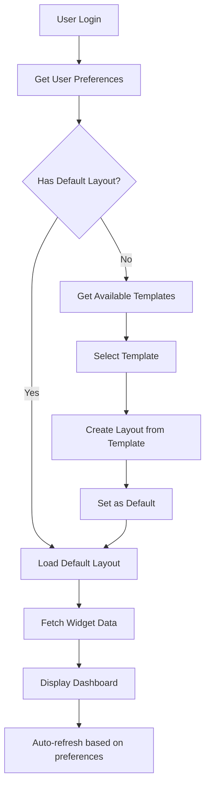

# Dashboard API Documentation

## Overview
The dashboard module provides a modular, customizable dashboard system with widgets, layouts, templates, and user preferences.

## Complete Flow for Frontend Implementation

### 1. Initial Dashboard Setup Flow



### 2. Core Entities and Relationships

#### DashboardLayout
```typescript
{
  id: string;
  name: string;
  columns: number; // default: 12
  rowHeight: number; // default: 80
  widgets: DashboardWidget[];
  isDefault: boolean;
  userId: string;
  createdAt: Date;
  updatedAt: Date;
}
```

#### DashboardWidget
```typescript
{
  id: string;
  type: WidgetType; // enum: stats, activity-feed, alerts, resource-usage, user-presence, system-health, ups-status
  position: {
    x: number; // 0-11 for 12 column grid
    y: number; // row position
    w: number; // width in columns (1-12)
    h: number; // height in rows
  };
  settings: Record<string, any>; // widget-specific settings
  layoutId: string;
}
```

#### DashboardPreference
```typescript
{
  id: string;
  theme: 'light' | 'dark';
  refreshInterval: number; // milliseconds, min: 5000
  dateFormat: string; // e.g., 'YYYY-MM-DD'
  timeFormat: string; // e.g., 'HH:mm:ss'
  timezone: string; // e.g., 'UTC'
  userId: string;
}
```

### 3. API Endpoints and Expected Data

#### 3.1 Get Dashboard Templates
```http
GET /dashboard/templates
Authorization: Bearer {token}

Response:
[
  {
    "id": "default-admin",
    "name": "Admin Dashboard",
    "description": "Complete admin overview",
    "columns": 12,
    "rowHeight": 80,
    "widgets": [
      {
        "type": "stats",
        "position": { "x": 0, "y": 0, "w": 12, "h": 2 },
        "settings": {}
      },
      {
        "type": "resource-usage",
        "position": { "x": 0, "y": 2, "w": 6, "h": 3 },
        "settings": {}
      },
      {
        "type": "activity-feed",
        "position": { "x": 6, "y": 2, "w": 6, "h": 3 },
        "settings": { "limit": 10 }
      }
    ]
  }
]
```

#### 3.2 Create Layout from Template
```http
POST /dashboard/layouts/from-template
Authorization: Bearer {token}
Content-Type: application/json

{
  "templateId": "default-admin",
  "name": "My Admin Dashboard", // optional, will use template name if not provided
  "setAsDefault": true // optional, default: false
}

Response:
{
  "id": "uuid",
  "name": "My Admin Dashboard",
  "columns": 12,
  "rowHeight": 80,
  "widgets": [...],
  "isDefault": true,
  "userId": "user-uuid",
  "createdAt": "2025-01-05T12:00:00Z",
  "updatedAt": "2025-01-05T12:00:00Z"
}
```

#### 3.3 Create Custom Layout
```http
POST /dashboard/layouts
Authorization: Bearer {token}
Content-Type: application/json

{
  "name": "Custom Dashboard",
  "columns": 12, // optional, default: 12
  "rowHeight": 80, // optional, default: 80
  "widgets": [
    {
      "type": "stats",
      "position": {
        "x": 0,
        "y": 0,
        "w": 12,
        "h": 2
      },
      "settings": {}
    },
    {
      "type": "alerts",
      "position": {
        "x": 0,
        "y": 2,
        "w": 4,
        "h": 3
      },
      "settings": {
        "severity": ["critical", "warning"]
      }
    }
  ]
}

Response: Same as layout object above
```

#### 3.4 Update Layout
```http
PUT /dashboard/layouts/:id
Authorization: Bearer {token}
Content-Type: application/json

{
  "name": "Updated Dashboard Name", // optional
  "columns": 12, // optional
  "rowHeight": 80, // optional
  "widgets": [...] // optional, complete array to replace all widgets
}
```

#### 3.5 Set Layout as Default
```http
POST /dashboard/layouts/:id/default
Authorization: Bearer {token}

Response:
{
  "message": "Layout set as default successfully"
}
```

#### 3.6 Get User Preferences
```http
GET /dashboard/preferences
Authorization: Bearer {token}

Response:
{
  "id": "uuid",
  "theme": "dark",
  "refreshInterval": 30000,
  "dateFormat": "YYYY-MM-DD",
  "timeFormat": "HH:mm:ss",
  "timezone": "UTC",
  "userId": "user-uuid"
}
```

#### 3.7 Update Preferences
```http
PUT /dashboard/preferences
Authorization: Bearer {token}
Content-Type: application/json

{
  "theme": "light", // optional
  "refreshInterval": 60000, // optional, min: 5000
  "dateFormat": "DD/MM/YYYY", // optional
  "timeFormat": "HH:mm", // optional
  "timezone": "Europe/Paris" // optional
}
```

### 4. Widget Data Endpoints

#### 4.1 Stats Widget
```http
GET /dashboard/full
Authorization: Bearer {token}

Response:
{
  "stats": {
    "totalVMs": 150,
    "activeVMs": 120,
    "totalServers": 25,
    "activeServers": 23,
    "totalUsers": 50,
    "activeUsers": 45,
    "totalRooms": 10,
    "occupiedRooms": 8
  },
  "lastUpdated": "2025-01-05T12:00:00Z"
}
```

#### 4.2 Activity Feed Widget
```http
GET /dashboard/widgets/activity-feed?limit=10&offset=0
Authorization: Bearer {token}

Response:
{
  "activities": [
    {
      "id": "uuid",
      "type": "vm_created",
      "message": "VM 'web-server-01' created",
      "userId": "user-uuid",
      "timestamp": "2025-01-05T11:50:00Z",
      "metadata": {
        "vmId": "vm-uuid",
        "vmName": "web-server-01"
      }
    }
  ],
  "total": 100,
  "hasMore": true
}
```

#### 4.3 Alerts Widget
```http
GET /dashboard/widgets/alerts?severity=critical,warning&limit=20
Authorization: Bearer {token}

Response:
{
  "alerts": [
    {
      "id": "uuid",
      "severity": "critical",
      "title": "Server Down",
      "message": "Server 'db-01' is not responding",
      "timestamp": "2025-01-05T11:45:00Z",
      "acknowledged": false,
      "metadata": {
        "serverId": "server-uuid",
        "serverName": "db-01"
      }
    }
  ],
  "total": 5,
  "unacknowledged": 3
}
```

#### 4.4 Resource Usage Widget
```http
GET /dashboard/widgets/resource-usage?period=24h
Authorization: Bearer {token}

Response:
{
  "cpu": {
    "current": 65.5,
    "average": 55.2,
    "peak": 89.3,
    "history": [
      { "timestamp": "2025-01-05T00:00:00Z", "value": 45.2 },
      // ... hourly data points
    ]
  },
  "memory": {
    "current": 78.2,
    "average": 72.5,
    "peak": 85.0,
    "history": [...]
  },
  "storage": {
    "used": 2500, // GB
    "total": 5000, // GB
    "percentage": 50.0
  }
}
```

#### 4.5 User Presence Widget
```http
GET /dashboard/widgets/user-presence
Authorization: Bearer {token}

Response:
{
  "online": [
    {
      "userId": "uuid",
      "username": "admin",
      "status": "online",
      "lastSeen": "2025-01-05T12:00:00Z",
      "location": "Room A"
    }
  ],
  "offline": [...],
  "away": [...],
  "totalOnline": 15,
  "totalOffline": 35,
  "totalAway": 5
}
```

#### 4.6 System Health Widget
```http
GET /dashboard/widgets/system-health
Authorization: Bearer {token}

Response:
{
  "overall": "healthy", // healthy, degraded, critical
  "services": [
    {
      "name": "Database",
      "status": "healthy",
      "uptime": 99.99,
      "responseTime": 25, // ms
      "lastCheck": "2025-01-05T11:59:00Z"
    },
    {
      "name": "Redis Cache",
      "status": "healthy",
      "uptime": 99.95,
      "responseTime": 5
    }
  ],
  "checks": {
    "database": true,
    "redis": true,
    "storage": true,
    "network": true
  }
}
```

#### 4.7 UPS Status Widget
```http
GET /dashboard/widgets/ups-status
Authorization: Bearer {token}

Response:
{
  "devices": [
    {
      "id": "ups-01",
      "name": "Main UPS",
      "status": "online", // online, on-battery, low-battery, fault
      "batteryLevel": 95,
      "runtime": 45, // minutes
      "load": 35, // percentage
      "inputVoltage": 230,
      "outputVoltage": 230,
      "temperature": 25, // celsius
      "lastUpdate": "2025-01-05T11:59:30Z"
    }
  ],
  "summary": {
    "total": 3,
    "online": 3,
    "onBattery": 0,
    "faults": 0
  }
}
```

### 5. Complete Frontend Implementation Flow

#### Step 1: Initial Load
```javascript
// 1. Get user preferences
const preferences = await api.get('/dashboard/preferences');

// 2. Get user layouts
const layouts = await api.get('/dashboard/layouts');

// 3. Find default layout or prompt for template selection
const defaultLayout = layouts.find(l => l.isDefault);

if (!defaultLayout) {
  // Show template selection
  const templates = await api.get('/dashboard/templates');
  // User selects template...
  const newLayout = await api.post('/dashboard/layouts/from-template', {
    templateId: selectedTemplate.id,
    setAsDefault: true
  });
}
```

#### Step 2: Load Widget Data
```javascript
// For each widget in the layout
for (const widget of layout.widgets) {
  switch (widget.type) {
    case 'stats':
      const stats = await api.get('/dashboard/full');
      break;
    case 'activity-feed':
      const activities = await api.get('/dashboard/widgets/activity-feed', {
        params: { limit: widget.settings.limit || 10 }
      });
      break;
    // ... handle other widget types
  }
}
```

#### Step 3: Auto-refresh
```javascript
// Set up auto-refresh based on preferences
setInterval(() => {
  refreshWidgetData();
}, preferences.refreshInterval);
```

#### Step 4: Update Layout
```javascript
// When user drags/resizes widgets
const updatedLayout = await api.put(`/dashboard/layouts/${layoutId}`, {
  widgets: updatedWidgets
});
```

### 6. Important Notes

1. **Authentication**: All endpoints require JWT token in Authorization header
2. **Validation**: 
   - Widget positions must fit within layout columns
   - Refresh interval minimum is 5000ms
   - Only one default layout per user
3. **Permissions**: 
   - Regular users can only manage their own dashboards
   - Admin role required for `/dashboard/history` endpoint
4. **Grid System**: 
   - Default 12-column grid
   - Widget width (w) cannot exceed available columns
   - Position x + width must be <= columns
5. **Widget Settings**: Each widget type may have specific settings in the `settings` object

### 7. Error Responses

All endpoints return consistent error format:
```json
{
  "statusCode": 400,
  "message": "Validation failed",
  "error": "Bad Request",
  "details": {
    "field": "refreshInterval",
    "constraint": "Minimum value is 5000"
  }
}
```

Common error codes:
- 400: Bad Request (validation error)
- 401: Unauthorized (missing/invalid token)
- 403: Forbidden (insufficient permissions)
- 404: Not Found (resource doesn't exist)
- 409: Conflict (e.g., duplicate layout name)