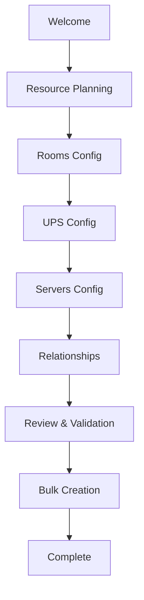

# Setup Flow - Phase 2 Multi-Resource Configuration

## Vue d'ensemble

Le nouveau setup utilise un workflow **bulk** qui permet de configurer tous les types de ressources (salles, UPS, serveurs) en une seule fois, avec validation et création atomique.

## Workflow Principal



## Étapes Détaillées

### 1. **Welcome Step**
- Introduction au processus de configuration
- Aucun changement par rapport à l'ancien flow

### 2. **Resource Planning** (Nouveau)
- **Templates prédéfinis** : Chargés depuis le backend
  - Small Business, Enterprise, etc.
- **Configuration personnalisée** : Partir de zéro
- **Pas d'obligation d'import** - c'est un choix

### 3. **Configuration par Type de Ressource**

#### Rooms Config
```typescript
// Exemple de données saisies
{
  name: "Server Room 1",
}
```

#### UPS Config
```typescript
{
  name: "UPS-01",
  ip: "192.168.1.100",    // Optionnel
  roomId: "temp_room_1",  // Référence à une salle
}
```

#### Servers Config
```typescript
{
  name: "WEB-01",
  ip: "192.168.1.10",
  roomId: "temp_room_1",   // Référence à une salle
  upsId: "temp_ups_1",     // Référence à un UPS
  type: "physical",
  priority: 1,
  // ... autres champs serveur
  tempId: "temp_server_1"
}
```

### 4. **Relationships Step**
- **Vue d'ensemble** des relations entre ressources
- **Modification visuelle** des assignations
- Gestion des IDs temporaires pour les relations

### 5. **Review & Validation**
- **Validation automatique** de la configuration
- **Test de connectivité** (optionnel) sur les IPs
- **Aperçu complet** avant création

### 6. **Bulk Creation**
- **Transaction atomique** : tout ou rien
- **Résolution automatique** des IDs temporaires
- **Gestion d'erreurs** avec rollback

## Options de Configuration

### 🚀 **Méthode 1 : Templates (Recommandée)**

```typescript
// Templates disponibles depuis le backend
{
  "Small Business": {
    rooms: [{ name: "Server Room" }],
    upsList: [{ name: "UPS-01", roomId: "..." }],
    servers: [{ name: "SRV-01", roomId: "...", upsId: "..." }]
  }
}
```

**Avantages :**
- Configuration rapide
- Bonnes pratiques pré-configurées
- Personnalisable après sélection

### 🔧 **Méthode 2 : Configuration Manuelle**

- Ajout ressource par ressource via les formulaires
- Contrôle total sur chaque paramètre
- Idéal pour configurations spécifiques

### 📁 **Méthode 3 : Import (Optionnel)**

```json
{
  "rooms": [
    { "name": "Server Room 1" }
  ],
  "upsList": [
    { "name": "UPS-01", "ip": "192.168.1.100" }
  ],
  "servers": [
    { "name": "WEB-01", "ip": "192.168.1.10" }
  ]
}
```

**Formats supportés :**
- JSON (structure ci-dessus)
- CSV (par type de ressource)

## Avantages du Nouveau System

### ✅ **Pas d'Import Obligatoire**
- **Templates** : Configuration rapide sans fichier
- **Interface graphique** : Formulaires intuitifs
- **Import optionnel** : Pour migrations ou configurations complexes

### ✅ **Validation Intelligente**
- **Vérification des données** avant création
- **Test de connectivité** automatique
- **Gestion des erreurs** avec messages explicites

### ✅ **Gestion des Relations**
- **IDs temporaires** pendant la configuration
- **Résolution automatique** lors de la création
- **Vue graphique** des relations

### ✅ **Performance & Fiabilité**
- **Une seule transaction** au lieu de multiples appels
- **Rollback automatique** en cas d'erreur
- **Pas d'états partiels** possible

## Migration depuis l'Ancien Système

### Routes Redirigées (Compatibilité)
```typescript
// Anciennes routes → Nouvelles routes
"/setup/create-room"   → "/setup/rooms"
"/setup/create-ups"    → "/setup/ups"
"/setup/create-server" → "/setup/servers"
```

### Templates depuis Configuration Existante
Les configurations existantes peuvent être sauvegardées comme templates :

```typescript
// Sauvegarde de la config actuelle
setupStore.saveTemplate("Ma Configuration", "Description...");
```

## Exemple Complet

```typescript
// 1. Sélection template ou configuration manuelle
const template = await setupStore.loadTemplates();

// 2. Configuration des ressources (UI ou import)
setupStore.addRoom({ name: "Server Room 1" });
setupStore.addUps({ name: "UPS-01", roomId: "temp_room_1" });
setupStore.addServer({ name: "WEB-01", roomId: "temp_room_1", upsId: "temp_ups_1" });

// 3. Validation
const validation = await setupStore.validateConfiguration(true);

// 4. Création en bulk
if (validation.valid) {
  const result = await setupStore.applyConfiguration();
}
```

## API Endpoints

### Nouveaux Endpoints

| Method | Endpoint | Description |
|--------|----------|-------------|
| `POST` | `/api/setup/bulk` | Création bulk de toutes les ressources |
| `POST` | `/api/setup/validate` | Validation de la configuration |
| `GET` | `/api/setup/templates` | Récupération des templates |
| `POST` | `/api/setup/templates` | Sauvegarde d'un template |
| `GET` | `/api/setup/progress/enhanced` | Progression détaillée |

### Structure de Requête Bulk

```typescript
POST /api/setup/bulk
{
  "rooms": [
    { "name": "Server Room 1", "tempId": "temp_room_1" }
  ],
  "upsList": [
    { "name": "UPS-01", "ip": "192.168.1.100", "roomId": "temp_room_1", "tempId": "temp_ups_1" }
  ],
  "servers": [
    { "name": "WEB-01", "ip": "192.168.1.10", "roomId": "temp_room_1", "upsId": "temp_ups_1" }
  ]
}
```

### Structure de Réponse

```typescript
{
  "success": true,
  "created": {
    "rooms": [{ "id": "uuid-1", "name": "Server Room 1", "tempId": "temp_room_1" }],
    "upsList": [{ "id": "uuid-2", "name": "UPS-01", "tempId": "temp_ups_1" }],
    "servers": [{ "id": "uuid-3", "name": "WEB-01" }]
  },
  "idMapping": {
    "rooms": { "temp_room_1": "uuid-1" },
    "ups": { "temp_ups_1": "uuid-2" }
  }
}
```

## Gestion des Erreurs

### Validation Errors
```typescript
{
  "valid": false,
  "errors": [
    {
      "resource": "server",
      "index": 0,
      "field": "ip",
      "message": "IP address is required"
    }
  ],
  "warnings": [
    {
      "resource": "ups",
      "index": 0,
      "message": "IP not reachable"
    }
  ]
}
```

### Bulk Creation Errors
```typescript
{
  "success": false,
  "errors": [
    {
      "resource": "server",
      "name": "WEB-01",
      "error": "Room not found"
    }
  ]
}
```

## Configuration Frontend

### Store Structure
```typescript
interface ImprovedSetupData {
  rooms: BulkRoomDto[];
  upsList: BulkUpsDto[];
  servers: BulkServerDto[];
  templates: {
    roomTemplates: RoomTemplate[];
    serverTemplates: ServerTemplate[];
  };
  bulkImport?: {
    format: 'csv' | 'json';
    data: any;
  };
}
```

### Temporary IDs System
- **Format** : `temp_${timestamp}_${counter}`
- **Usage** : Relations entre ressources avant création
- **Résolution** : Automatique lors du bulk create
- **Mapping** : Retourné dans la réponse pour référence

## Tests et Validation

### Tests de Connectivité
```typescript
// Test automatique des IPs lors de la validation
const validation = await setupStore.validateConfiguration(true);

if (validation.connectivityResults) {
  validation.connectivityResults.servers.forEach(result => {
    console.log(`Server ${result.ip}: ${result.accessible ? 'OK' : 'KO'}`);
  });
}
```

### Validation des Relations
- Vérification que `roomId` référence une salle existante
- Vérification que `upsId` référence un UPS existant
- Détection des références circulaires

## Conclusion

**Non, l'import n'est pas obligatoire !** Le nouveau système offre 3 approches flexibles :

1. **Templates prédéfinis** (le plus rapide)
2. **Configuration manuelle** (le plus flexible) 
3. **Import de fichier** (pour migrations)

L'interface reste intuitive tout en ajoutant la puissance des opérations bulk et de la validation automatique.

## Liens Utiles

- [Backend Specification](../back-spec.md)
- [UPS Navigation Flow](./UPS_NAVIGATION_FLOW.md)
- [Setup Improvement Proposal](../SETUP_IMPROVEMENT_PROPOSAL.md)