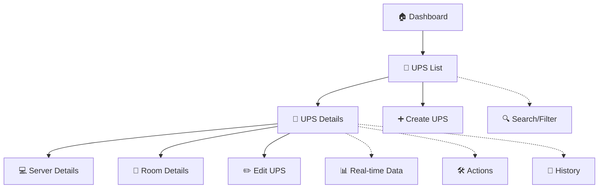

# 🔋 UPS Navigation Flow - SaaS Style

## ✨ **Modernized UPS Experience**

### 📋 **UPS List View** (`/ups`)
```
┌─────────────────────────────────────────────────────────────┐
│  🔋 UPS Management                                          │
│  Manage your power infrastructure                          │
│                                                             │
│  ┌─────┐ ┌─────┐ ┌─────┐ ┌─────┐                           │
│  │ 15  │ │ 14  │ │  1  │ │  3  │  ← Stats Cards            │
│  │Total│ │Online│ │Offline│ │Rooms│                        │
│  └─────┘ └─────┘ └─────┘ └─────┘                           │
│                                                             │
│  🔍 Search & Filter Bar                                     │
│  ┌─────────────────────────┐ ┌────────┐ ┌──────┐           │
│  │ Search UPS by name...   │ │Room ▼ │ │15 res│            │
│  └─────────────────────────┘ └────────┘ └──────┘           │
│                                                             │
│  📱 UPS Cards Grid (Clickable)                             │
│  ┌─────────────┐ ┌─────────────┐ ┌─────────────┐           │
│  │🔋 UPS Alpha │ │🔋 UPS Beta  │ │🔋 UPS Gamma │           │
│  │230.1V •🟢ON │ │229.8V •🟢ON │ │231.2V •🔴OFF│           │
│  │Load: ██45%  │ │Load: ███65% │ │Load: █20%   │           │
│  │Batt: ███85% │ │Batt: ██50%  │ │Batt: ████95%│           │
│  │Runtime: 38m │ │Runtime: 25m │ │Runtime: --m │           │
│  │3 servers    │ │5 servers    │ │0 servers    │           │
│  └─────────────┘ └─────────────┘ └─────────────┘           │
└─────────────────────────────────────────────────────────────┘
```

### 🔧 **UPS Detail View** (`/ups/:id`)
```
┌─────────────────────────────────────────────────────────────┐
│ ← Back    🔋 UPS Alpha    192.168.1.100    🟢 Online        │
├─────────────────────────────────────────────────────────────┤
│ Action Bar:                                                 │
│ [🔧 Self Test] [🛡️ Test Battery] [⚡ Check Status] [✏️ Edit] │
├─────────────────────────────────────────────────────────────┤
│ Tabs: [Overview] [Monitoring] [Connected Servers] [History] │
│                                                             │
│ 🎯 OVERVIEW TAB:                                           │
│ ┌──────────────────────────────────────────────────────────┐│
│ │ Real-time Metrics (Live Updates Every 5s)               ││
│ │ ┌─────────┐ ┌─────────┐ ┌─────────┐ ┌─────────┐         ││
│ │ │🔋 Load  │ │🔋 Batt  │ │⏱️ Runtime│ │🌡️ Temp │         ││
│ │ │  45%    │ │  85%    │ │  38min  │ │ 24.5°C │         ││
│ │ │██████▒▒│ │████████▒│ │         │ │        │         ││
│ │ └─────────┘ └─────────┘ └─────────┘ └─────────┘         ││
│ │                                                         ││
│ │ Power Specifications     │  Maintenance Info             ││
│ │ • Input: 230.5V         │  • Room: Server Room A        ││
│ │ • Output: 229.8V        │  • Last Test: 7 days ago      ││
│ │ • Frequency: 50.0Hz     │  • Next Test: 7 days          ││
│ │ • Grace On: 10s         │                               ││
│ │ • Grace Off: 15s        │                               ││
│ └─────────────────────────────────────────────────────────┘│
│                                                             │
│ 💻 CONNECTED SERVERS TAB:                                  │
│ ┌──────────────────────────────────────────────────────────┐│
│ │ Server Stats: [3 Total] [3 Active] [395W Total Power]   ││
│ │                                                         ││
│ │ 💻 Web Server 01     • 192.168.1.10  • 120W  🟢Active  ││
│ │ 💻 Database Server   • 192.168.1.11  • 180W  🟢Active  ││
│ │ 💻 Storage Server    • 192.168.1.12  • 95W   🟢Active  ││
│ │                                                         ││
│ │ (Click any server → Navigate to server details)         ││
│ └─────────────────────────────────────────────────────────┘│
│                                                             │
│ 📊 MONITORING TAB: [Charts & Graphs - Coming Soon]         │
│ 📝 HISTORY TAB: [Timeline of Events & Tests]               │
└─────────────────────────────────────────────────────────────┘
```

## 🎨 **Design System Elements**

### 🎯 **Color Scheme**
- **Primary**: Amber/Orange `#F59E0B` (UPS theme)
- **Success**: Emerald `#10B981` (Online/Good states)
- **Warning**: Amber `#F59E0B` (Medium load/battery)
- **Danger**: Red `#EF4444` (Offline/Critical states)
- **Background**: Slate gradients `from-slate-50 to-slate-100`

### 🔧 **Interactive Elements**
- **Hover Effects**: Scale transform `hover:scale-[1.02]`
- **Loading States**: Spinner animations
- **Real-time Updates**: Smooth transitions
- **Progressive Disclosure**: Tabs and expandable sections

### 📱 **Responsive Design**
- **Mobile First**: Stack cards vertically
- **Tablet**: 2-column grid
- **Desktop**: 3-column grid with sidebar details
- **Touch Friendly**: Large click targets

### ⚡ **Key Features**

#### 🔄 **Real-time Monitoring**
- Live metrics update every 5 seconds
- Battery level with color-coded warnings
- Load percentage with progress bars
- Temperature monitoring
- Runtime estimation

#### 🛠️ **UPS Operations**
- Self-test initiation with progress feedback
- Battery testing capabilities
- Status checking with visual indicators
- Configuration editing with validation

#### 🔗 **Server Integration**
- Connected servers list with power consumption
- Click-through navigation to server details
- Total power load calculation
- Server status monitoring

#### 📊 **Advanced Analytics**
- Event timeline with categorized icons
- Maintenance scheduling
- Historical data tracking
- Performance metrics

## 🚀 **Navigation Flow**



## ✅ **Implementation Status**
- ✅ Modern SaaS-style list view
- ✅ Comprehensive detail page with tabs
- ✅ Real-time metrics simulation
- ✅ Interactive UPS cards with warnings
- ✅ Connected servers management
- ✅ Complete EN/FR translations
- ✅ Responsive design implementation
- ✅ Click-through navigation flow
- ⏳ Advanced monitoring charts (placeholder)